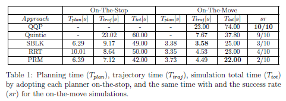

# Tiago grasping on-the-move
This project has been developed for the master course Autonomous & Mobile Robotics at La Sapienza University of Rome.

Inspiration paper: "An Architecture for Reactive Mobile Manipulation On-The-Move" https://arxiv.org/abs/2212.06991

## Project Description
A reactive architecture made up of three controllers allows Tiago Robot to grasp and place a static object on-the-move (i.e. without stopping). The results are more gracefullness in the entire task execution and a minor task execution time.

For more information, check the report in this repository.

#### Controllers:
- Mobile base controller: leads tiago to the right place of the environment to allow grasping and placing operations.
- Arm controller: brings the end-effector to the desired pose using a quintic-polynomial timing law for a rest-to-rest linear trajectory.
- Redundancy resolution controller: coordinates the base and arm movements in proximity of the grasping target.

The arm controller is implemented with the mentioned reactive quintic polynomial appraoch (QQP) and compared with non-reactive approaches (SBLK, RRT, PRM).

#### Used technologies:
- Gazebo virtual environment
- ROS
- MoveIT plugin
- Python


## Installation
Follow the installation installation instructions on https://wiki.ros.org/Robots/TIAGo/Tutorials. Install catkin_tools, create a catkin workspace and clone this repository in the ```src``` folder.

Source the tiago workspace

```
source <PATH_TO_TIAGO_WS>/tiago_public_ws/devel/setup.bash
```

Compile in Release mode by properly setting your catkin workspace
```
catkin config --cmake-args -DCMAKE_BUILD_TYPE=Release
```


Build your code
```
catkin build
```

Source the setup.bash that have been created into the ```devel``` folder
```
source ./devel/setup.bash
```

## Usage
Visualize Tiago on the Gazebo environment
```
roslaunch labrob_tiago_gazebo tiago_gazebo.launch public_sim:=true end_effector:=pal-gripper world:=post_ball_polygonbox
```

Run the simulation
```
roslaunch tiago_grasping_on_the_move tiago_grasping_on_the_move.launch
```


## Results
Simulations and comparisons between the on-the-move and on-the-stop simulations are reported in the following table in terms of planning time, trajectory time, total task execution time and success rate:



### Collaborators
Claudio Schiavella (https://github.com/GitCharlie00)

Lorenzo Cirone (https://github.com/lorenzocirone)
